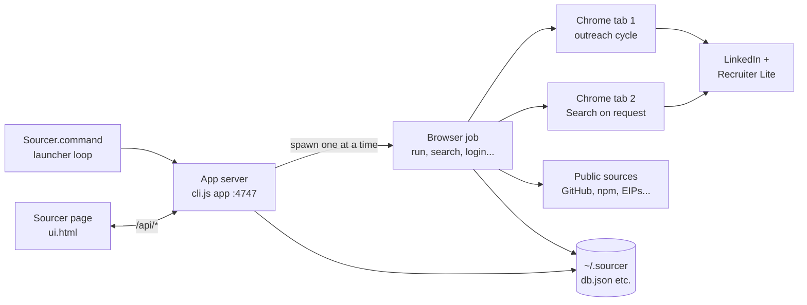
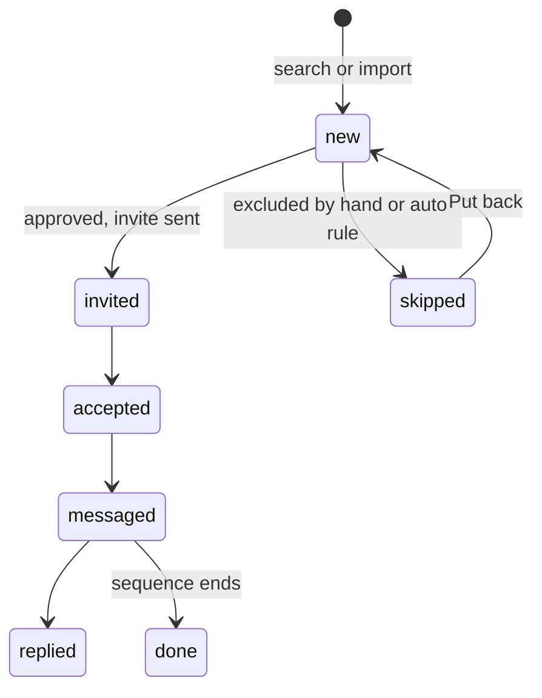
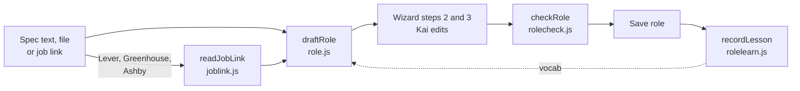
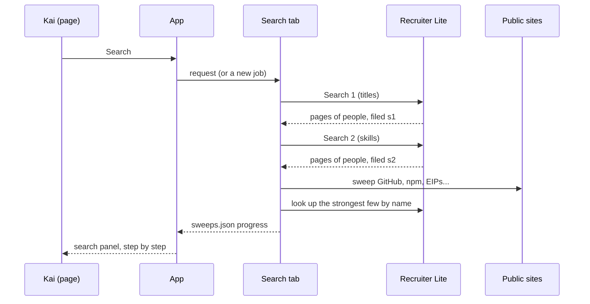
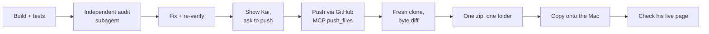

# Sourcer: Technical Architecture

As of 24 Sep 2026, build a874888. The live, editable copy is the Claude Doc "Sourcer: Technical Architecture" (https://claude.ai/code/artifact/994cd46c-6b07-48ae-960a-5b07ff603443). When the code changes, update both.

## Overview

Sourcer finds candidates for Kai's open roles on LinkedIn Recruiter Lite and public developer sites, lets him pick who to approach, then sends connection requests, follow-ups and InMails at a human pace. It runs only on Kai's Mac, as Kai, in a real Chrome window he logged into himself. Nothing is sent from a server.

This doc describes build a874888 (pushed and deployed 24 Sep 2026). It is the source of truth: when the code and this doc disagree, one of them is wrong and gets fixed.

Design principles, in priority order:

1. **Kai decides.** Sourcer finds and ranks; only people Kai approves are contacted. Every automatic decision shows its reason in plain words.
2. **Never guess about people.** Two people with one name are left for Kai to check. An excluded person never comes back, by any route.
3. **Protect the account.** Daily caps, working hours, human pauses and a hard stop on any LinkedIn security check.
4. **Clients are off limits.** Nobody who works at any role's client is ever contacted.
5. **Local and private.** All data lives in `~/.sourcer` on the Mac. No cloud database, no tracking.
6. **Learns from Kai.** His approvals, excludes, corrections and replies tune ranking, searches and role reading. Every lesson can be seen and undone.

Tech: Node 20+, Playwright driving Chromium (or Kai's Chrome), plain HTML page with no framework, JSON files for storage, `node --test` for tests. Code: [github.com/AustinWerner-KAI/fishandchipsandcurrysource](https://github.com/AustinWerner-KAI/fishandchipsandcurrysource).

## System and runtime

One Node process serves the page; each browser job runs as a separate child process that owns the one logged-in Chrome profile.

Kai starts it in Terminal with `cd ~/Documents/sourcer && bash Sourcer.command` (macOS Gatekeeper blocks a double-click). The launcher installs packages and Playwright's Chromium when needed, then runs `node src/cli.js app` in a loop. Exit code 75 means "updated": the loop reinstalls and starts again.

| Piece | What it does | Where |
| --- | --- | --- |
| Launcher | Install, start, restart on update (exit 75) | Sourcer.command |
| App server | Page, JSON API, job control, update watcher | src/app.js, src/jobs.js |
| Browser job | One at a time; owns the Chrome profile | src/cli.js via Jobs.start |
| Outreach tab | The run cycle: acceptances, messages, replies, companies, connect, InMail | src/run.js |
| Search tab | A Search pressed during a run opens a second tab in the same Chrome, with its own Store | run.js watchForSearches |
| Requests | Page asks, running job picks up on its next pass | src/requests.js |
| Files | All state | ~/.sourcer (SOURCER_HOME overrides) |

**Self-update.** Every 5 seconds the app checks the newest modified time of any `src/**/*.js`. After a change settles for 10 seconds it restarts. A running search or run is stopped politely (up to 90 seconds so the current person is finished), written to `resume.json`, and started again within 10 minutes of the restart. It never restarts during a login or a "Show me once" recording. `ui.html` is read per request, so a page-only change needs no restart.

**One browser, one device.** Only one browser job runs at a time because the logged-in profile can only be opened once. LinkedIn therefore sees one person on one Mac, with at most two tabs.

## Code map

Every module in `src/`, grouped by layer. Pure modules (no browser) are unit tested; browser modules are covered by the fake-LinkedIn e2e and live checks.

| Module | Owns | Browser? |
| --- | --- | --- |
| app.js | HTTP server, /api/*, page state, job control, self-update | No |
| ui.html | The whole page: roles, searches, people, finds, outreach, settings | No |
| cli.js | Every command (app, run, search, login, sources...) | Starts one |
| jobs.js | One browser job at a time as a child process, log ring buffer | No |
| run.js | Outreach cycle and the second-tab Search | Yes |
| browser.js | Launch Chrome with the Mac's own profile, window size, guard for checkpoints | Yes |
| selectors.js | Every LinkedIn selector, candidates tried in order | No |
| heal.js | When LinkedIn moves a control, asks Kai which one it is and remembers | Yes |
| record.js | "Show me once": records Kai clicking a route for Claude to automate | Yes |
| linkedin.js | Profile-level operations (visit, connect, message, read replies) | Yes |
| store.js | db.json: leads, finds, companies, actions; merge on save; findTwin | No |
| config.js, paths.js | Campaign files and where everything lives | No |
| role.js | Role reader: title, team, family, skills, Search 1 and Search 2 builders | No |
| joblink.js | Lever, Greenhouse, Ashby links read as JSON | Fetch only |
| rolecheck.js | The role check: findings with one-click fixes | No |
| rolelearn.js | What Kai's corrections teach the role reader | No |
| excludelearn.js | What Kai's excludes teach both searches | No |
| rank.js, learn.js | Score 0 to 100 with reasons; the learning loop | No |
| limits.js | Daily caps, working hours, human pauses | No |
| offlimits.js | Clients and their people are never contacted | No |
| template.js | Message tags ({firstName}, {role}...) and checks | No |
| sweeps.js | Per-role progress of the latest Search, for the panel | No |
| requests.js, stop.js | Page-to-job requests; polite stop flag | No |
| notify.js, log.js | Mac notifications; the log | No |
| company.js | Sector, headcount, tenure parsing | No |
| dashboard.js | Old read-only dashboard | No |

**actions/** (browser steps): recruiter.js (Recruiter search and filing, Search 1 and 2), search.js (search entry point, searchAndSweep), sources.js (public sweep and LinkedIn look-ups), connect.js (Recruiter find to /in/ profile, invites), followup.js (acceptances, follow-ups, replies), inmail.js (InMail with rehearsal mode), company.js (company page facts), import.js (lists and queues).

**sources/** (public sites, no LinkedIn): github.js, npm.js, crates.js, eips.js, stackexchange.js, sherlock.js, hackerone.js, plus http.js (one polite client: user agent, about one request a second), registry.js (what each site allows), shape.js (one find shape), merge.js (finds to one person) and search.js (one search across all).

## Data model

All state is JSON in `~/.sourcer` plus one file per role in `campaigns/`. Several processes write `db.json` at once (app, run tab, search tab), so every save merges field by field onto what is on disk now.

| File | Holds | Written by |
| --- | --- | --- |
| ~/.sourcer/db.json | leads, finds, companies, actions, meta | Store (every process) |
| campaigns/&lt;role&gt;.json | One role: title, place, searches, messages, caps, client, learned-exclude undo list | App (role save), search (location ids) |
| ~/.sourcer/sweeps.json | Latest Search per role, step by step, for the panel | sweeps.js |
| ~/.sourcer/role-lessons.json | Up to 60 specs with what was guessed and what Kai saved (0600) | rolelearn.js |
| ~/.sourcer/requests.json | Searches asked for while a run is going | requests.js |
| ~/.sourcer/resume.json | The job to carry on after a self-update | app.js |
| ~/.sourcer/browser-profile/ | The logged-in Chrome profile | browser.js |
| ~/.sourcer/screenshots/, sourcer.log | Evidence when a page looks wrong; the log | many |

**Lead** (keyed by normalised LinkedIn URL): name, headline, currentTitle, company, location, degree, campaign, status, approved, skippedByHand, foundBy (s1, s2), foundOn (public evidence), recruiterUrl, invitedAt, acceptedAt, queue of messages, notes, error.

Any state can go to `error` when a profile breaks; `replied` stops everything automatic.

**Find**: one person seen on public sites (name, GitHub, company, sources, evidence, weight, lastActiveAt) plus the LinkedIn look-up outcome: matched, already-on-file, ambiguous (with twinUrl), excluded, no-match, lookup-failed. Finds are never deleted; noise is marked `hidden`.

**Merge rules on save.** Leads: only fields this process changed are written. Finds: merged row by row. Companies: a cache, never removed. Actions: appended. Meta maps (`learned`, `health`): merged row by row. A lock directory (stale after 10 seconds) serialises writes, and the temp file carries the pid.

**Role** (in the campaign file): title, team, family, location, workType, candidateLocations, titles, skills (must-haves), recruiterSkills (key skill), domain, exclude, boolean (Search 1), boolean2 (only if Kai edited Search 2), booleanEdited, specHints, titleGuessed, suggestedSkills, client, source (recruiter or linkedin), geo ids, learnedExcludeOff.

## Roles

A role is drafted from a spec in three steps, checked, and saved; everything Kai changes before saving teaches the reader.

**Reading the spec** (`draftRole` in role.js):

- **Title.** Candidate lines must contain a job word (engineer, manager, head, MLRO...). Lines that are headings, places, pay, work type or prose are rejected. "Software Engineer - Environment Platform" splits into the title and a team hint; rank-only titles such as "VP, Engineering" stay whole. When no line names the job, the title comes from the role family and is marked `titleGuessed`.
- **Family.** engineering, security, compliance, sales or devrel, read from the title and the whole spec.
- **Skills.** Known tech skills, counted by mentions (only a capitalised "Go" counts; K8s counts for Kubernetes). Words Kai taught come first; words he keeps removing are not offered.
- **Key skill.** The first recruiterSkill, used in Recruiter's Skills filter and as Search 2's first group.
- **Spec hints.** Languages and engineering concepts (distributed systems, APIs, controllers...) saved with the role so Search 2 can be rebuilt without the spec.
- **Industry.** A domain group (crypto, fintech, payments...) when the spec names one.

**Job links.** Lever (US and EU), Greenhouse and Ashby publish postings as open JSON, so the exact title, location, work type and full text come from the board. The fetch has a 15 second limit that covers the body, refuses redirects and anything over 5 MB. Any other site: Kai pastes the text.

**The role check** runs as Kai types and before saving. Each finding is ok, warn or bad, in plain words, often with a one-click fix:

| Check | Bad or warn when |
| --- | --- |
| title | No title, a place, a link, no job word, the company name; warn if it still has a team or was guessed |
| fit | The title's family and the spec's family disagree |
| stray | Either search has a single character (R and C allowed), a stray word, a place or the company's name |
| titles | A title in Search 1 is a place |
| key | No key skill, or Search 2 is missing it |
| where | No office location for an on-site role |
| differ | No Search 2, or Search 2 repeats Search 1's titles |
| seniority | Senior variants that may narrow the search |

Saving with anything bad asks Kai to confirm.

**Reader learning.** For a new role, the spec, the draft and what Kai saved are kept (60 at most). A skill he adds becomes vocabulary; one he removes more often than he adds stops being offered. Every kept spec is re-read by today's reader, so the New role screen shows "title right first time on N of M roles" and whether a change to the reader helped or hurt.

## Searching

Every press of Search runs Search 1, then Search 2, then the public sweep, in one browser tab, sharing one list of people Kai excluded.

| | Search 1 | Search 2 |
| --- | --- | --- |
| Built from | Titles and their variants, must-haves, industry | Key skill (with aliases), must-haves, languages and concepts from the spec, the kind of role, industry |
| Finds | People whose title matches | People with the skills whose title Search 1 misses |
| Stored as | role.boolean (Kai can edit) | Built live by secondSearchFor; role.boolean2 only if Kai edited it |
| Tag on people | s1 | s2 (both if found by both) |
| Runs for | Recruiter and LinkedIn roles | Recruiter roles only |

Search 2 is skipped, with the reason shown, when it has fewer than two groups to AND. A Search 2 failure never loses Search 1's people; a security check or logout stops everything.

**Recruiter run** (actions/recruiter.js): widen the window if LinkedIn served its narrow layout, open the search box, type the boolean like a person, add each location as a filter (a location that will not apply stops the search), add the key skill filter, then read up to 5 pages, scrolling to load them, pausing 6 to 15 seconds between pages. Each page is filed straight away and the panel updated.

**Public sweep** (actions/sources.js): GitHub, npm, crates.io, EIP/ERC authors, Stack Exchange, Sherlock, HackerOne. Finds merge into one record per person. Named people are looked up on LinkedIn by full name, strongest first: 8 per Search, 3 when pressed during a run (they share the day's 60 profile views with outreach). Two LinkedIn people with the name: never guessed. Same name as someone already in People: shown as "Same name as someone in People" for Kai to check.

**Exclusion guarantee.** A person Kai excluded by hand never comes back into To approve, by any route:

1. Same Recruiter address or same /in/ address.
2. Same name in the same role, whatever company they now show (`store.excludedTwin`). Trade-off, chosen so an excluded person can never slip back: another person with exactly the same name in that role is left out too.
3. The public sweep: a match to an excluded person is marked excluded, never filed.

The panel says how many excluded people each Search met, counted once across both searches and the sweep.

**Excludes teach both searches** (excludelearn.js, worked out fresh each time from Kai's picks):

- A word from the headline or current title, or a company, qualifies when at least 3 hand-excludes share it and at least a quarter of all his excludes have it.
- It must also be at least 3 times more common among his excludes than among everyone else in the role, and held by no more than 1 in 10 of them.
- Never learned: anything a kept person has (approved, invited, contacted, replied), with at least one kept person required; the role's own words and their plurals, places and client names; seniority words; pronouns and words about who someone is rather than their work.
- At most 6 terms, single words and companies only, added to both searches' NOT group at search time. Anything that isn't plain letters and digits is quoted.
- The role card shows each term with how many excludes share it and an Undo (saved as learnedExcludeOff). A toast says when an exclude teaches something. Putting a person back removes the lesson automatically.

LinkedIn's NOT matches anywhere on a profile, old jobs included, which is why these rules are strict.

## Ranking and outreach

Each person gets a 0 to 100 match with readable reasons; Kai approves; the run cycle contacts approved people within caps and working hours.

**Score** (rank.js), from what the search result shows:

| Signal | Points |
| --- | --- |
| Role title is their main title (further down the headline: 25) | 40 |
| Role's must-have words | 20 |
| Seniority | 15 |
| Industry | 15 |
| Skills from the spec | up to 5 |
| 2nd degree connection | 5 |
| Learned from Kai (learn.js) | up to 15 either way |

**Learning loop** (learn.js). Replies count 3, accepted invites 2, approvals and invites 1, hand-excludes minus 1, invites ignored for 3 weeks minus 0.5, and people passed over while lower-ranked ones were ticked minus 0.3. A word needs at least 3 examples, and nothing is learned until there are 2 real "no"s. People at clients and automatic skips never teach.

**Held back automatically** (Kai can override with Contact anyway): under 12 months in the current job, too little experience for the role's level, junior titles, over-levelled, 1st connections (their own lane), and anyone at any role's client.

**The run cycle** (run.js), repeated every 15 to 40 minutes inside working hours:

1. Acceptances: one page of recent connections, matched to invites.
2. Messages: follow-ups due (default: 3 hours after acceptance, then a nudge 4 days later).
3. Replies: open threads, check who spoke last. A reply stops everything automatic and notifies the Mac.
4. Companies: read each new employer's page once for sector and headcount.
5. Connect: approved Recruiter finds are swapped for their /in/ profile (one profile view), then invited with the role's note.
6. InMail: for approved people not connecting. The first is always a rehearsal, filled in but not sent, until Kai approves the wording.

**Limits** (limits.js), per LinkedIn account, with the day counted in Dubai time:

| Limit | Default |
| --- | --- |
| Invites a day | 15 (settable, 25 at most) |
| Invites a rolling week | 80 |
| Messages a day | 25 |
| Profile views a day | 60 (shared with Search look-ups) |
| InMail credits a month | 30 (a reply within 90 days gives it back) |
| Pause between actions | 45 to 180 seconds |
| Pause between cycles | 15 to 40 minutes |
| Working hours | 09:30 to 18:00, Mon to Fri, the role's timezone |

Messages use tags ({firstName}, {role}, {location}, {workType}); a message with a long dash, an unknown tag or no first name is held back with the reason shown.

## The app

The page polls `/api/state` every few seconds and redraws only what changed; every button posts to one JSON endpoint on localhost:4747.

**Page sections, top to bottom:** header (job status, LinkedIn and Recruiter login state), role tabs, What Sourcer has been taught (controls Kai pointed out when LinkedIn moved them), the next step line, the role card (both searches, learned excludes, key skill, Edit role, Show me once), the search panel (each step of the latest Search, the funnel, excluded count), Found elsewhere (public finds by group), Outreach (replies first), InMail, 1st connections, People (filters by status and by where they came from: Only Search 1, Only Search 2, Both searches, public sources), Activity log, Outreach and settings.

| Endpoint | Does |
| --- | --- |
| GET /api/state?c=role | Everything the page shows for one role, incl. search2, learnedNot, finds, sweep |
| GET /api/log | Job log lines since a number |
| POST /api/job | Start or stop a browser job (search, run, once, login...) |
| POST /api/approve, /api/status | Approve people; exclude, put back, set status |
| POST /api/hold-override | Contact anyway, past an automatic hold |
| POST /api/role/draft | Read spec text, file or job link into a draft, checks and learning line |
| POST /api/role/boolean | Rebuild Search 1 and Search 2 (and the kind of role) from the wizard |
| POST /api/role/check | The role check for what is on screen |
| POST /api/role/save | Save a role; a new one records a lesson |
| POST /api/role/unlearn | Undo or re-use a learned exclude term |
| POST /api/campaign, /api/campaign/delete | Settings; delete a role (people kept on file) |
| POST /api/queue, /api/unqueue, /api/direct, /api/note | Per-person messages and notes |
| POST /api/inmail-approve, -sent, -replied | The InMail lane |
| POST /api/heal, /api/forget | Answer or forget a moved-control question |
| POST /api/import, /api/clear, /api/firstname, /api/preview | Lists in, clear uncontacted, first names, message preview |
| GET /export.csv | Everyone, as a spreadsheet |

The server binds to 127.0.0.1 only. Every person's URL travels in a data attribute, never inside script text, and every value is escaped before it is drawn. The page follows the Mac's light or dark mode and works at phone width.

## Safety

The account, the candidates and Kai's clients are protected by hard rules that no setting turns off.

| Risk | Rule | Where |
| --- | --- | --- |
| LinkedIn security check | Any checkpoint page stops the job at once; Kai completes it by hand in the same Chrome | browser.js guard, CheckpointError |
| Logged out | Stops and asks Kai to press Log in; never enters a password | NotLoggedInError, cli login |
| Looking like a bot | The Mac's own timezone, locale and window size; typing like a person; 45 to 180 second pauses; at most two tabs | browser.js, limits.js |
| Too much activity | Daily and weekly caps per account, shared profile-view budget, working hours | limits.js |
| LinkedIn moves a control | Stops and asks Kai which one it is in the page; never clicks a guess | heal.js, selectors.js |
| Contacting a client's staff | Every role's client, by company page and other names, is off limits for every role | offlimits.js |
| Contacting someone twice | One lead per person; Recruiter and /in/ addresses joined; twins by name checked | store.js findTwin, connect.js |
| Messaging after a reply | A reply stops all automatic messages and notifies the Mac | followup.js |
| A new InMail layout | First InMail is a rehearsal, filled in and not sent | inmail.js |
| Public sites | One polite client: a user agent with a contact address, about a request a second, only sites whose terms allow it | sources/http.js, registry.js |

**Privacy.** All data stays on the Mac in `~/.sourcer`. The role lessons file is readable only by Kai's user. The server is reachable only from the Mac itself. Exclude learning never uses pronouns or words about who someone is.

**Stopping.** Stop is polite: the current person is finished, then the job ends. Closing the Terminal window stops everything.

## Build, test, audit, push, deploy

Nothing is called done until it is live on Kai's Mac and checked on his own page. The order never changes: build, audit, show Kai what the audit found and fixed, ask, push, deploy, verify.

**Tests.** `npm test` runs every `test/*.test.js` (262 at a874888): role reader and job links, role check, reader learning, Search 2, exclude learning, store merges and twins, sweeps, sources, limits, app endpoints. `npm run test:browser` runs Playwright against a fake LinkedIn page (narrow layout, facets, search box); in the cloud workspace set `SOURCER_CHROME=/opt/pw-browsers/chromium-1194/chrome-linux/chrome`.

**Local page check.** Start a copy of Kai's data with `SOURCER_HOME` and `SOURCER_CAMPAIGNS` pointing at the copy and `node src/cli.js app --port 4799`. First make sure no older server holds the port: a stale server once made screenshots show old code. Check light, dark and 390px width, no page errors, no sideways scroll.

**Audit.** A separate agent reads the diff against the last pushed commit, reproduces each issue with a script, ranks confirmed against plausible, then re-verifies after the fixes.

**Push.** `git push` and the GitHub REST API are refused from the cloud workspace; pushes go through the GitHub connector's push_files tool, with file contents passed exactly. An escaped character code inside a file (the accent-stripping regex in learn.js and excludelearn.js) can be turned into the real character on the way, so it needs double checking. Then clone fresh and diff every pushed file byte for byte. Repo: AustinWerner-KAI/fishandchipsandcurrysource, branch main.

**Deploy.**

1. Zip the pushed commit as one folder, `sourcer/`, into `Documents/Sourcer.zip` on the Mac.
2. On the Mac: unzip into `~/sourcer-update`, compare with `Documents/sourcer`, copy new modules first, then changed files. Never replace the whole folder: `node_modules` and the campaigns stay.
3. The app sees the new `.js` files, restarts itself within about 15 seconds and carries on any job.
4. Open http://localhost:4747 in the built-in browser and check the change is there in the DOM and state (for this build: `#rsBoolean2` filled and `search2` in `/api/state`).

**Editing Kai's db.json by hand** (rare, for example hiding noise finds): wait until no `db.json.lock` exists, write a temp file, rename it over, read it back. Never delete finds; mark them hidden.

## Known gaps and open decisions

Nothing here blocks daily use; each line is either a setting to add, a trade-off to confirm, or something not yet proven live.

| Item | Effect | Next step |
| --- | --- | --- |
| GITHUB_TOKEN not set | GitHub source runs rate-limited (shown as "limited") | Kai adds a read-only token |
| SOURCER_CONTACT not set | Public sites see "contact-not-set" in the user agent and may block | Set an email address |
| New York roles send in Asia/Dubai hours | Card reads "09:00 to 18:00 Asia/Dubai" for a New York role | Kai to confirm: his hours or the candidates' |
| Search 2 not yet seen in a live Search | Deployed and on the card; the panel line shows from the next Search | Check after Kai's next Search |
| Exclude learning unproven on live data | Nothing learned yet from current excludes (correctly) | Watch the first terms it learns |
| Same-name exclusion | Excluding one person keeps out anyone else with exactly that name in the role | Confirm with Kai, or narrow to name + company |
| Other-language role words | "Securite" is not recognised as the role word "security" | Add common translations if French or German specs appear |
| Search 2 in LinkedIn search | Runs in Recruiter Lite only | Only if Kai moves a role off Recruiter |
| dashboard.js | Old read-only dashboard, superseded by the app | Remove when nothing uses it |
